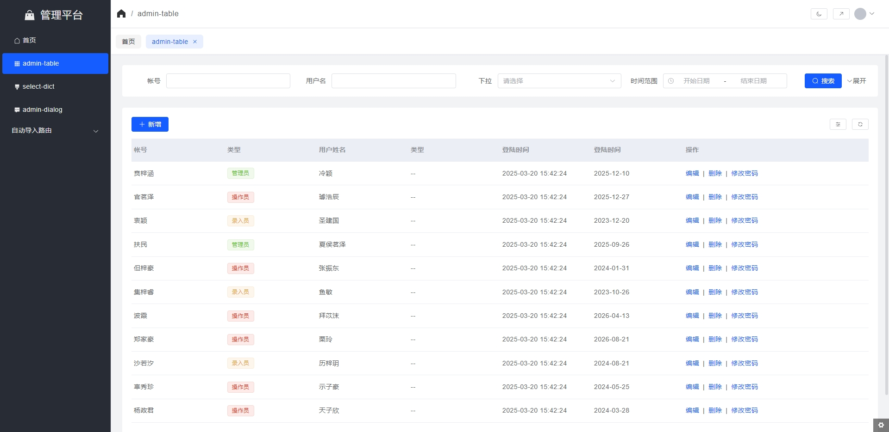
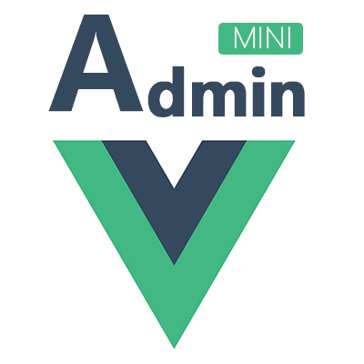

 **预览**
 
 
 # 更新日志：
  ### 0.0.4 20251022
- 支持手机端的展示，手机时，侧边栏目自动隐藏，然后点击打开按钮才展示侧边栏目。
- admin-dialog，支持手机，或者小尺寸，当手机时，自动满屏显示。
- admin-dialog，支持esc退出，支持使用回车提交
- 使用双token，access_token有效期过期后，使用refresh_token进行刷新
- 支持配置多语言包
- 把一些参数抽出来作配置，例如响应内容的code = 0或者0000代表成功
- 把侧边栏目的样式做一个优化，更美化
  ### 0.0.3 20250320
- 更新adminDialog 以及应用方式
- 更新adminTable 以及应用方式
- 新增admin-grid
- 新增admin-space
- 新增filter-table
- 新增dict-input组件
- 新增标签页功能
- 更新登陆页样式
- 更新整体布局
- 更新$formatter.dict (可自动渲染成el-tag)
  ### 0.0.2 20240725
 - 大面积升级依赖
 - 调整全局布局样式
 - 调整bread位置到layout层

 ### 0.0.1 20240122
 - 大面积升级依赖
 - 移除node-sass 曾导致项目无法安装问题

# ✨简介


 element-plus-admin-mini 完全免费、可商用。

 基于Vue3+vite+element-plus+js。
 
 提炼了大量项目使用频率最高的功能；

 **核心亮点： adminDialog**

 解决一个模块增删改查都在一个vue文件问题
  
 ```html
 <!-- 使用前 -->
 <template>
  ...搜索DOM
  ...列表dom
  <el-dialog>...新增DOM</el-dialog>
  <el-dialog>...修改DOM</el-dialog>
 </template>
 <script>
 ...列表页逻辑
 ...新增逻辑
 ...修改逻辑
 </script>

 <!-- 使用后 -->
  | index.vue
  | add.vue
  | edit.vue

<!-- index.vue -->
<template>
...搜索DOM
...列表dom
</template>
<script>
...列表逻辑
</script>

<!-- add.vue -->
<template>
...新增dom
</template>
<script>
...新增逻辑
</script>

<!-- edit.vue -->
<template>
...修改dom
</template>
<script>
...修改逻辑
</script>
 ```

 仅需要调用

 ```javascript 
 //其他代码
 function openAdd() {
  adminDialog({
    component: import('./add.vue'),
    props: {
      onSuccess: () => {
        $table.getTable()
      }
    },
    dialogType:"drawer",//可以指定抽屉，默认为dialog
    dialogProps: { title: '新增' }
  })
}
//其他代码
 ```
[兼容若依分支](https://github.com/admin-mini/element-plus-admin-mini/tree/ruoyi)

[中文文档](http://admin-mini.gitee.io/element-plus-admin-mini-docs/)

[预览](http://admin-mini.gitee.io/element-plus-admin-mini/)

如果需要了解项目细节，可以阅读我在掘金的专栏 
[admin-mini 手摸手](https://juejin.cn/column/7287965561035489299)

# 🏆特性
- 动态开发环境切换：（开发、测试、生产、mock）轻松切换
- admin-table:封装和扩展性之间找到的最佳平衡的列表插件
- admin-dialog：**函数化导入vue文件** 到弹出层，业务代码极为清晰
- auto-route:自动化路由
- 内置$dict字典：项目全局可用
- 极简权限：提供基础权限校验


# 🚀快速开始

**必要环境**

nodejs16+

推荐使用nvm来切换新老项目[下载nvm-windows](https://github.com/coreybutler/nvm-windows/releases)

## 下载

```bash
  git clone https://github.com/admin-mini/element-plus-admin-mini.git
```
gitee镜像
```bash
  git clone https://gitee.com/admin-mini/element-plus-admin-mini.git
```

## 安装

```bash
  cd element-plus/admin-mini
  npm i  #或 yarn
  npm run dev
```


**为什么使用JS而不是TS？**
- 快速上手，适用于小型团队
- 保持js的灵活性以及纯净
- 普通的CURD项目TS并无优势，反而增加工作量


